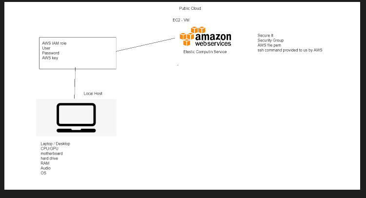

# SRE Intro
## User Journey
> A user journey is a process that the user experiences when navigating pages. It is used in the design process for websites, to identify the different ways that the user can undertake to reach their intended page, in a quick and efficient manner.
### User Experience
#### Cloud Computing with AWS
##### AWS Services

- Creating github repo to push the markdown doc
-  Amazon Web Services (AWS)

#

### What is the SRE role?
SRE (Site reliability Engineer) responsible for maintaing site integrity, ensuring that it doesn't fall apart or crashes, while making sure that the users have a positive user journey.

#### SRE traits
- Studious
- Problem Solver
- Creative
- Communicative

### Benefit of Cloud Computing
- Ease of use

> Can quickly and securely host application. Can uses the AWS Management Console to access hosting platform.

- Flexibility

> Enables developers to choose whichever operating system, programming language, different platforms, database and other services. 
  
- Robustness

> AWS also provide scalability, so that the application can upscale or downscale according to the demand.
  
- Cost

> Pay for what you use, so no monthly payment or contract payment. Only payment for the resources that has been used.

# AWS
Amazon Web Service provides an online storage solution for organisations to host their application without the expensive cost attached with the hardware.

## AWS global infrastructure
> The global infrasturcture of AWS means that they have data center across multiple countries and developers can choose whichever one they want to use for deploying their application.

## Regions VS Avaailabilty Zones
> Regions are different cities or countries where AWS is available, whereas availablity zones are multiple isolated locations within the regions. 

## What are the four pillars of cloud computing?
> Ease of use (how easy it is to use), Flexibility (What system and langauges it can support), Robustness (can it keep with the demand) and Cost (How much it costs)

## What is CDN?
> Content delivery network is where a group of distributed servers, situated in different locations work together to provide a fast delivery of internet content.

## On-Site VS Hybrid - On-Site VS Public Cloud
> On-Site is the most expensive out of the 3 options, the hardware needs to be bought and security can be an issue. But it allows greater control over the infrastructure.

> Public Cloud (Off site) is cheap and enable developer to deploy and only use the resources that they require, but they don't have a lot of control over the infrastructure.

> Hybrid is a combination of both, it helps seperate the private and public data easier.


# EC2 Service Model



The EC2 Service model has 3 components: The Service(Public Cloud), the Credential role and the local host. 

## The local host 
The localhost has the local device hardware component to establish a link between the itself and the amazon web service. It also stores the file.permission on the device. (WHY?)

## The Credential 
The credential is the login details that enables the connection to be established securely. It requires the Username, Password and the AWS key.

## The Public Cloud 
The public cloud is the AWS itself, providing cloud online storage and solutions to organisation and developers. It needs to be secured and it produces a file.Perm as an SSH key that is shared with its sole user and nobody else.


# Steps to create an AWS EC2 Instance
1) On the Amazon Management Conole, Search for EC2 and click on the link. It will take you to the EC2 dashboard.
2) Click on the launch Instance button, and it will show 2 options. Select the launch instance options.
3) Choose a operating system that you would like to use as the virtual environment and then click continue.
4) Choose the instance type, and then click continue.
5) Configure the instance details and renamed them so that its easier to find these instance when they are running then continue.
6) you can choose to define how much storage you would want your instance to have: continue
7) Add any tags that you need to use: continue
8) Configure security option is where you set up a private and public connection to the cloud. public connection is where everyone can access it, private connection can only be accessed by yourself with the IP address and ssh key.

### Linux Command
- How to start a service `sudo systemctl start name_service`
- How to stop a service `sudo systemctl stop name_service`
- How to check status `systemctl status service_name`
- How to enable service `sudo systemctl enable service_name`
- How to install a package `sudo apt install package_name -y`
- How to remove a package `sudo apt remove package_name -y`
- How to check all process `top`
- Who am i `uname` or `uname -a`
- Where am i `pwd`
- Create a dir `mkdir dir_name`
- How to check `ls` or `ls -a`
- How to create a file `touch name_file` or `nano file_name`
- How to check content of the file without going inside the file `cat file_name`
- How to move a file `mv file_name dir_name`
- How to delete folder `rm -rf folder_name`

### File Permissions
- How to check a file permission `ll`
- Change file permission `chmod required_permission file_name`
- write `w` read `r` exe `x`
- http://chmod-calculator.org/

### Bash Scripting

- code block
```bash
# create a file called provision.sh
touch provision.sh
# it must start with #!/bin/bash
#!/bin/bash
# run updates
sudo apt-get update -y
#run upgrades
sudo apt-get upgrade -y
# install nginx
sudo apt-get install nginx -y
# ensure it's running - start nginx
sudo systemctl start nginx
# enable nginx
sudo systemctl enable nginx
```

- Change the file to exe `sudo chmod +x provision.sh`
- How to run an exe file `./provision.sh`


# Tomcat

```bash
#!/bin/bash
#update
sudo apt-get update -y
#upgrade
sudo apt-get upgrade -y
#install tomcat
sudo apt-get install tomcat9 -y
#ensure it's running - start tomcat
sudo systemctl start tomcat9
#enable tomcat
sudo systemctl enable tomcat9
```
Remember to change the inbound rule for the AWS security group, to allow port 8080 to be used, else it will just blocked and fail the attempt for using tomcat.